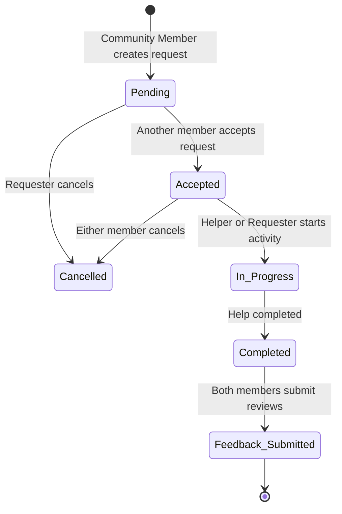
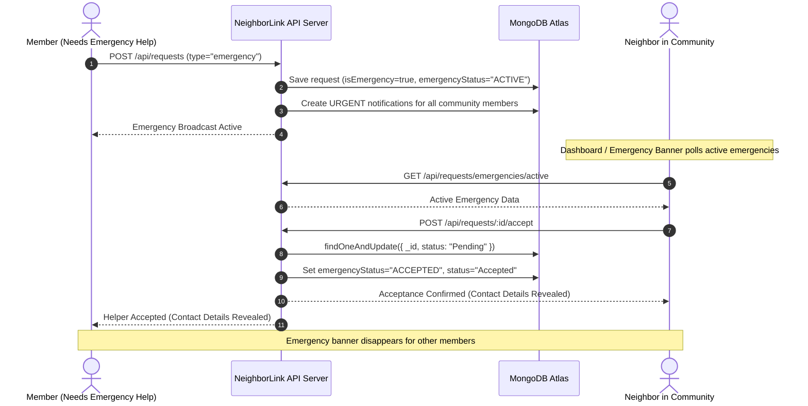
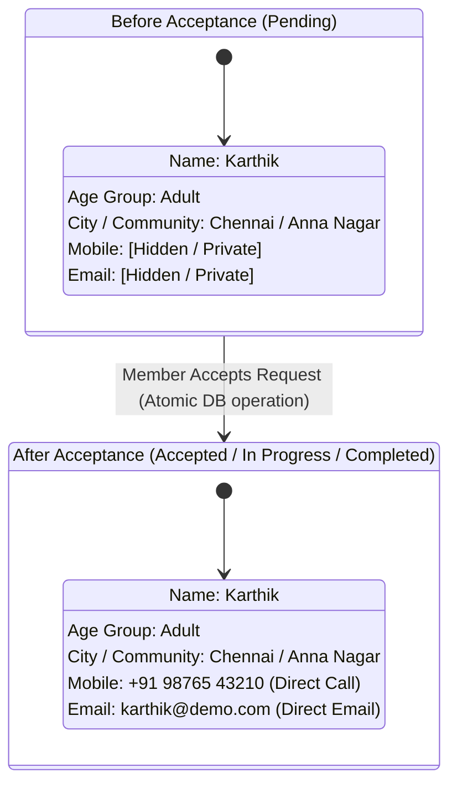

# System Diagrams

## 1. Request Lifecycle Diagram

```mermaid
stateDiagram-v2
    [*] --> Pending : Community Member creates request
    Pending --> Accepted : Another member accepts request
    Pending --> Cancelled : Requester cancels
    Accepted --> In_Progress : Helper or Requester starts activity
    Accepted --> Cancelled : Either member cancels
    In_Progress --> Completed : Help completed
    Completed --> Feedback_Submitted : Both members submit reviews
    Feedback_Submitted --> [*]
```

## 2. Emergency Flow Diagram

```mermaid
sequenceDiagram
    autonumber
    actor Requester as Member (Needs Emergency Help)
    participant Server as NeighborLink API Server
    participant DB as MongoDB Atlas
    actor Helper as Neighbor in Community

    Requester->>Server: POST /api/requests (type="emergency")
    Server->>DB: Save request (isEmergency=true, emergencyStatus="ACTIVE")
    Server->>DB: Create URGENT notifications for all community members
    Server-->>Requester: Emergency Broadcast Active

    Note over Helper: Dashboard / Emergency Banner polls active emergencies
    Helper->>Server: GET /api/requests/emergencies/active
    Server-->>Helper: Active Emergency Data
    Helper->>Server: POST /api/requests/:id/accept
    Server->>DB: findOneAndUpdate({ _id, status: "Pending" })
    Server->>DB: Set emergencyStatus="ACCEPTED", status="Accepted"
    Server-->>Helper: Acceptance Confirmed (Contact Details Revealed)
    Server-->>Requester: Helper Accepted (Contact Details Revealed)
    Note over Helper, Requester: Emergency banner disappears for other members
```

## 3. Contact Privacy Transition

```mermaid
stateDiagram-v2
    state "Before Acceptance (Pending)" as Before {
        [*] --> MaskedContact
        MaskedContact : Name: Karthik
        MaskedContact : Age Group: Adult
        MaskedContact : City / Community: Chennai / Anna Nagar
        MaskedContact : Mobile: [Hidden / Private]
        MaskedContact : Email: [Hidden / Private]
    }

    state "After Acceptance (Accepted / In Progress / Completed)" as After {
        [*] --> RevealedContact
        RevealedContact : Name: Karthik
        RevealedContact : Age Group: Adult
        RevealedContact : City / Community: Chennai / Anna Nagar
        RevealedContact : Mobile: +91 98765 43210 (Direct Call)
        RevealedContact : Email: karthik@demo.com (Direct Email)
    }

    Before --> After : Member Accepts Request (Atomic DB operation)
```
